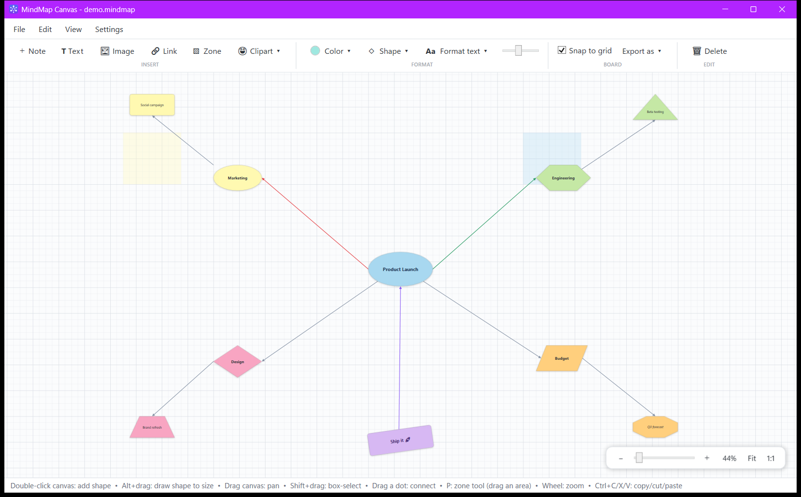
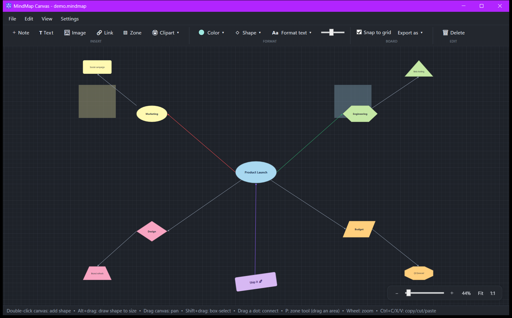

<div align="center">


# MindMap Canvas

**A fast, themeable mind-mapping board for Windows** - built with C# / WPF.
Sketch ideas on an infinite gridded canvas, snap shapes together with anchored
connectors, and export the result anywhere.

[]()
[]()
[]()
[]()

</div>

---

## Preview

| Light theme | Dark theme |
|:---:|:---:|
|  |  |

*(Slate and Sepia themes are also included - switch live in **Settings → Settings…**.)*

## Install

**Installer (recommended)** - grab `MindMapCanvas-Setup-x.y.z.msi` from the
[latest release](https://github.com/ICSharperNow/mind-map-canvas/releases/latest)
and run it. It installs to Program Files and adds Start-menu and desktop shortcuts.

**Portable** - download `MindMapCanvas.exe` from the same release page and run it
from anywhere. Fully self-contained: no .NET installation required.

**Updating** - just run a newer installer over an existing install; it upgrades
in place (each release carries a higher version number, which triggers the
upgrade automatically). No need to uninstall first.

**Uninstalling** - remove it like any Windows app: Settings > Apps > Installed apps >
MindMap Canvas > Uninstall (or via Control Panel / `winget uninstall`).

**From source**

```bash
git clone https://github.com/ICSharperNow/mind-map-canvas.git
cd mind-map-canvas
dotnet run
```

Requires the .NET 8 SDK. Opening a `.json` board from the command line works too:
`MindMapCanvas.exe myboard.json`.

## Features

### Canvas
- **Infinite board** with a layered grid (subtle minor lines, stronger major lines)
- **Pan** by simply dragging empty canvas - or middle-drag / Space+drag
- **Zoom** 10%-400% with the wheel, anchored at the cursor; Fit and 100% shortcuts
- Window resizing keeps the view centered on the same spot
- **Snap to grid** toggle for tidy layouts

### Shapes
- Five shapes: **rectangle, ellipse, diamond, hexagon, parallelogram**, chosen from a
  visual gallery with live previews
- **Double-click** the canvas to place a shape, or **Alt+drag** to draw one at exactly
  the size you want
- Move by dragging, resize via the corner grip, nudge with arrow keys
- **16-color palette plus a full HSV custom color picker** (hue strip,
  saturation/value area, hex input)

### Connections
- Hover a shape to reveal **eight connector dots** (four sides + four corners)
- Drag a dot onto another shape to draw an arrow - the connection **stays pinned to the
  exact dots you chose** on both ends and follows the shapes as they move
- Arrows hug the true outline of ellipses and diamonds
- Click an arrow to select it; `Del` removes it

### Text
- Double-click a shape to type; Enter commits, Shift+Enter adds a newline
- Per-shape **font size, bold, italic, alignment, and text color** via the `Aa` dropdown

### Workflow
- **Copy / Cut / Paste** (Ctrl+C/X/V) - pastes land under the cursor and keep the
  connections between copied shapes
- **Duplicate** (Ctrl+D), box-select (Shift+drag), select-all, multi-drag
- **Save / Open** boards as human-readable JSON with an unsaved-changes guard
- **Export** the whole board as **PNG, JPEG, PDF, BMP, or TIFF**
- **Four themes** (Light, Dark, Slate, Sepia) applied live and remembered between runs

## Controls

| Action | Input |
|---|---|
| Add shape | Double-click canvas, or ＋ Note button |
| Draw shape to size | Alt+drag on empty canvas |
| Edit shape text | Double-click shape |
| Format text | `Aa` dropdown with shapes selected |
| Move shape(s) | Drag |
| Resize shape | Drag the corner resize grip |
| Connect shapes | Hover a shape, drag any of its 8 dots onto another shape |
| Pan | Drag empty canvas, middle-drag, or Space+drag |
| Zoom | Mouse wheel, Ctrl +/−, Fit, 100% |
| Box select | Shift+drag (Ctrl+drag adds to selection) |
| Toggle select | Ctrl+click |
| Copy / Cut / Paste | Ctrl+C / Ctrl+X / Ctrl+V |
| Duplicate | Ctrl+D |
| Select all | Ctrl+A |
| Nudge | Arrow keys (Shift = 1 px) |
| Delete | `Del` / `Backspace` |
| Cancel / clear | `Esc` |

## File format

Boards are plain JSON - friendly to diffs and scripts:

```json
{
  "Version": 1,
  "Nodes": [
    { "Id": "…", "X": 100, "Y": 80, "W": 168, "H": 96,
      "Text": "Idea", "Color": "#FFF9B1", "Shape": "Hexagon",
      "FontSize": 14, "TextColor": "#2D333A", "Align": "Center",
      "Bold": false, "Italic": false }
  ],
  "Connections": [
    { "From": "…", "To": "…", "FromAnchor": "Right", "ToAnchor": "Left" }
  ]
}
```

A ready-made example lives at [`docs/demo-board.json`](docs/demo-board.json) -
open it with **File → Open** or pass it on the command line.

## Building the installer

The MSI is authored with [WiX v5](https://wixtoolset.org/) (`installer/Product.wxs`):

```bash
dotnet publish -c Release -r win-x64 --self-contained true -p:PublishSingleFile=true
dotnet tool install --global wix --version 5.0.2
wix build -arch x64 -d PublishDir=bin/Release/net8.0-windows/win-x64/publish \
    -d AssetsDir=Assets -o dist/MindMapCanvas-Setup.msi installer/Product.wxs
```
